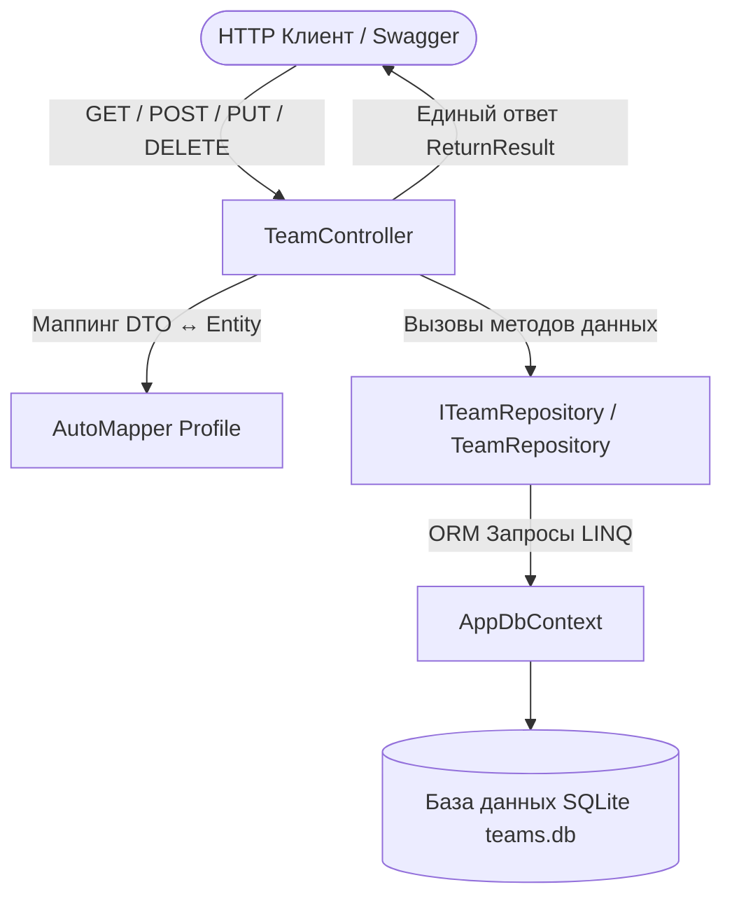

# Практическая работа 04: Управление командами (TeamsApi) с EF Core, Repository, DTO, AutoMapper и ReturnResult

## Цель работы
Разработать ASP.NET Core Web API для управления футбольными командами (`Team`), применив современную многослойную архитектуру:
1. Подключение базы данных с использованием **Entity Framework Core (Code First)**.
2. Реализация шаблона **Repository** для изоляции доступа к данным.
3. Использование **DTO (Data Transfer Object)** для сокрытия служебного поля `Description`.
4. Автоматическое преобразование моделей через **AutoMapper** (`ReverseMap()`).
5. Стандартизация всех ответов через единый формат **`ReturnResult<T>`**.
6. Реализация полного набора CRUD-операций и дополнительного поиска команд по городу (`GET /api/team/city/{city}`).

---

## Архитектура приложения

### Схема прохождения запроса (Request Flow)
```text
Клиент / Swagger
       │ (HTTP-запрос)
       ▼
TeamController
       │
       ├──► AutoMapper (преобразование DTO ◄──► Entity)
       │
       └──► ITeamRepository (TeamRepository)
                   │
                   ▼
             AppDbContext (EF Core ORM)
                   │
                   ▼
             SQLite Database (teams.db)
```



---

## Структура проекта

```text
Web_service_development_modul_04-pra_04/
├── .gitignore                          # Исключение временных файлов (bin/, obj/, .vs/)
├── TeamsApi.slnx                       # Файл решения .NET
├── README.md                           # Полный отчет по практической работе
├── DESIGN_AND_ANSWERS.md               # Архитектурный разбор и ответы на вопросы
└── src/
    └── TeamsApi/
        ├── Controllers/
        │   └── TeamController.cs       # REST API Контроллер с ReturnResult
        ├── Data/
        │   └── AppDbContext.cs         # Контекст EF Core с начальными данными
        ├── Mapping/
        │   └── AutoMapperProfile.cs    # Профиль маппинга Team ↔ TeamDto
        ├── Models/
        │   ├── Team.cs                 # Entity: Id, Name, City, Description
        │   ├── TeamDto.cs              # DTO: Id, Name, City (без Description)
        │   └── ReturnResult.cs         # Единый формат ответа API
        ├── Repositories/
        │   ├── ITeamRepository.cs      # Контракт интерфейса репозитория
        │   └── TeamRepository.cs       # Реализация доступа к данным через EF Core
        ├── Properties/
        │   └── launchSettings.json     # Профили запуска и порт 5000
        ├── appsettings.json            # Строка подключения к SQLite
        ├── Program.cs                  # Настройка DI, EF Core, AutoMapper и Swagger
        └── TeamsApi.csproj             # Файл проекта ASP.NET Core
```

---

## Спецификация Endpoints

| HTTP Method | URL | Назначение | Коды ответов |
|---|---|---|---|
| `GET` | `/api/team` | Получить список всех команд (DTO) | `200 OK` |
| `GET` | `/api/team/{id}` | Получить команду по ID | `200 OK`, `404 Not Found` |
| `POST` | `/api/team` | Добавить новую команду | `201 Created`, `400 Bad Request` |
| `PUT` | `/api/team/{id}` | Изменить существующую команду | `200 OK`, `400 Bad Request`, `404 Not Found` |
| `DELETE` | `/api/team/{id}` | Удалить команду по ID | `200 OK`, `404 Not Found` |
| `GET` | `/api/team/city/{city}` | **Поиск команд по городу** | `200 OK` |
| `GET` | `/swagger` | Интерактивная документация Swagger UI | `200 OK` |

---

## Разница между Entity (`Team`) и DTO (`TeamDto`)

| Поле | Entity (`Team`) | DTO (`TeamDto`) | Описание |
|---|:---:|:---:|---|
| `Id` | ✅ | ✅ | Уникальный числовой идентификатор |
| `Name` | ✅ | ✅ | Название команды |
| `City` | ✅ | ✅ | Город базирования команды |
| `Description` | ✅ | ❌ *(скрыто)* | Внутреннее служебное описание клуба |

---

## Примеры ответов API (`ReturnResult<T>`)

### 1. Получение всех команд (`GET /api/team`)
```json
{
  "isSuccess": true,
  "result": [
    {
      "id": 1,
      "name": "Астана",
      "city": "Астана"
    },
    {
      "id": 2,
      "name": "Кайрат",
      "city": "Алматы"
    },
    {
      "id": 3,
      "name": "Тобол",
      "city": "Костанай"
    }
  ],
  "errorMessage": []
}
```

### 2. Поиск по городу (`GET /api/team/city/Алматы`)
```json
{
  "isSuccess": true,
  "result": [
    {
      "id": 2,
      "name": "Кайрат",
      "city": "Алматы"
    }
  ],
  "errorMessage": []
}
```

### 3. Ошибка при поиске несуществующего ID (`GET /api/team/999`) — `404 Not Found`
```json
{
  "isSuccess": false,
  "result": null,
  "errorMessage": [
    "Команда с ID 999 не найдена."
  ]
}
```

---

## Запуск приложения

```bash
# 1. Собрать проект
dotnet build

# 2. Запустить Web API
dotnet run --project src/TeamsApi/TeamsApi.csproj
```

* **Swagger UI:** [http://localhost:5000/swagger](http://localhost:5000/swagger)
* **Список команд:** [http://localhost:5000/api/team](http://localhost:5000/api/team)

---

## Инструкция по отправке в GitHub

1. Создайте пустой репозиторий на GitHub (например, `Web_service_development_modul_04-pra_04`).
2. В терминале в папке `Web_service_development_modul_04-pra_04` выполните:
   ```bash
   git remote add origin https://github.com/<ВАШ_АККАУНТ>/<ИМЯ_РЕПОЗИТОРИЯ>.git
   git push -u origin main
   ```
